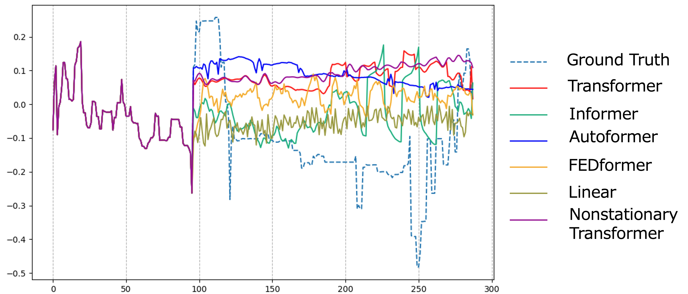
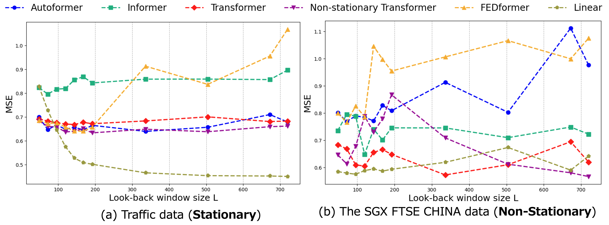
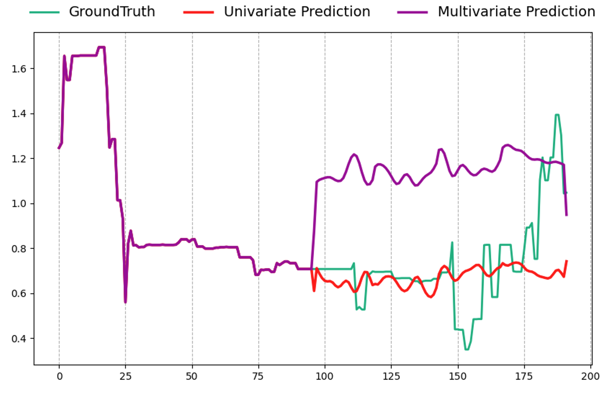

# Verification of the accuracy of time series forecasting by non-stationary transformers and the appropriateness of time series forecasting by transformer models

This code is implemented to re-examine the suitability of time series forecasting by transformers, which has been discussed in the past, by adding a non-stationary transformer as a new baseline.

Most of the code is based on the following paper, but has been refactored to fix bugs, add execution options, merge the non-stationary model, and add a notebook for drawing the results.

-  [Non-stationary Transformers: Exploring the Stationarity in Time Series Forecasting](https://arxiv.org/abs/2205.14415), NeurIPS 2022.
-  [Are Transformers Effective for Time Series Forecasting?](https://arxiv.org/abs/2205.13504),AAAI2023.


## Preparation

1. Install Python 3.12 and neccessary dependencies.
    Note the compatibility of pytorch installation with the cuda version.
    ```
    pip install -r requirements.txt
    ```


2. the six benchmark datasets can be obtained from [Google Drive](https://drive.google.com/file/d/1CC4ZrUD4EKncndzgy5PSTzOPSqcuyqqj/view?usp=sharing) or [Tsinghua Cloud](https://cloud.tsinghua.edu.cn/f/b8f4a78a39874ac9893e/?dl=1).

    In addition, the following data sets have been added. The datasets and EDA are from the following repo.

    - The SGX FTSE CHINA A50 INDEX Futures (新加坡交易所FTSE中国A50指数期货) tick depth data : [ML-HFT](https://github.com/bradleyboyuyang/ML-HFT)

## Training scripts


We provide the Transformers experiment scripts  under the folder `./scripts`.

If you want to run the forecast for each transformer, simply run the following code, where XXX is the name of the folder corresponding to each dataset and model_name is the name of each model.

```bash
bash ./scripts/XXX_script/model_name.sh

```
To perform the time-series forecasting experiment shown how to use all the transformers, run the following code, but be careful of the memory usage since it uses a lot of for statements in the bash file. If memory-related errors occur, you can solve them by increasing the allocation of virtual memory, increasing the physical memory of the PC, or reducing the number of elements in the for statement.

```bash
bash ./scripts/EXP_scripts/YYYYYYY.sh
```

## Experiment Results

### Results of 96 inputs and 192 predictions for SGX FTSE CHINA datasets

The Transformer models fails to scale and does not track value fluctuations.
It is suggested that the accuracy of the Non-stationary Trasformer is better than the other models for predicting the up/down fluctuation of values (correct response rate).




### Relationship between input size (look-back window sizes) and prediction error (MSE)

In models other than the non-stationary transformer, MSE tends to increase from a minimum value as input size increases, suggesting that overlearning occurs. On the other hand, for non-stationary transformers, the MSE decreases in proportion to the look-back window size for non-stationary data, suggesting that non-stationary time series can be successfully learned without overlearning.




### Scaling issues in Transformer models (univariate vs. multivariate forecasting)
The reason why the transformer model fails to scale and follow the variability of values is that the learning of the attention mechanism is limited to "periodicity" and "trend" only.　Based on this hypothesis, univariate forecasting of only the objective variable is sufficient, and the extra explanatory variables cause overlearning.




This result suggests the incompatibility of the ATTENTION mechanism with the non-stationarity of time series data, a result that can be taken to mean that time series forecasting using transformers is not very desirable.


<!-- ## Tips

The structure of this code and some tips for adapting arbitrary data sets will be presented.

First, for the structure, each Transformer (Vanilla Transformer, Informer, Autoformer,...) etc.) is exactly the same as each Transformer (Vanilla Transformer, Informer, Autoformer,...). The process flow is as follows.

1. **./scripts/XXX_script/model_name.sh**

    The data set and model to be used are specified here, and hyperparameters such as the number of input/output encoders and decoders, input length, prediction length, etc. are specified according to the size of the data set. By incorporating a "for" statement in this bash file, multiple predictions can be made in a single execution of the code under various conditions.
2. **./run.py**

    The default hyperparameter values are defined here.Parameter values not specified in the bash file are defined by the parameter values in this file.

3. **./exp/exp_basic.py** -> **./exp/exp_main.py**
4. **./data_provider/data_factor.py** -> **./data_provider/data_loader.py** -->

